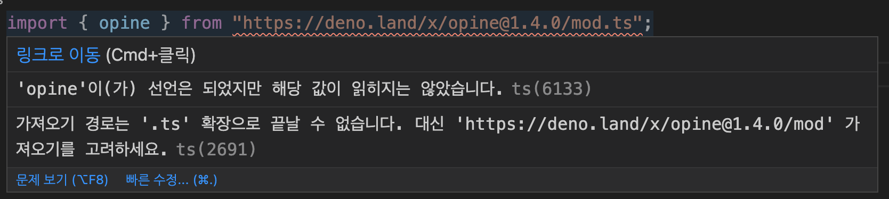
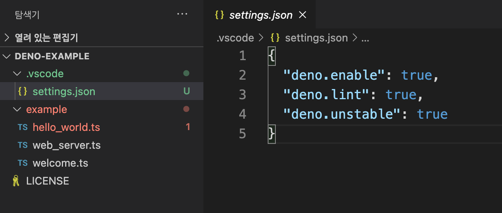

# VS Code에서 Deno 개발 환경

먼저 마켓플레이스에서 [Deno](https://marketplace.visualstudio.com/items?itemName=denoland.vscode-deno)를 설치한다.

그리고 VS Code를 재실행 한 이후에 TypeScript로 코드를 작성하다 보면 문제가 생긴다.

Deno에서 import 하는 아래의 코드는 VS Code에서는 경고가 발생한다.

```ts
import { opine } from "https://deno.land/x/opine@1.4.0/mod.ts";
```



가져오기 경로는 ".ts" 확장자로 끝날 수 없습니다.라는 경고가 발생하는데 이 부분은 아래의 방법으로 해결이 가능하다.

먼저 VS Code에서 `F1`을 누른 다음에 `deno: Init` 명령어를 실행하면 된다.

아래의 파일들이 자동으로 추가되고 VS Code를 재실행하겠냐는 창이 나오는데 다시 재실행하면 해결된다.



자동으로 `.vscode` 경로가 만들어지고 Deno 셋팅 관련 옵션들이 추가되었다.

---
#### 참고

https://github.com/denoland/deno/issues/5027